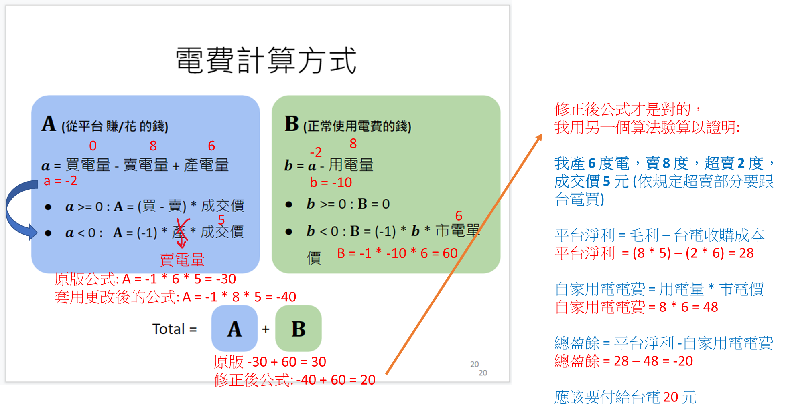

# DSAI-HW3-2021

## Source

  - [Slide](https://docs.google.com/presentation/d/1ZwXe4xMflCxiDQ7RK6z_LH88r0Dp38sQ/edit#slide=id.p1)
  - [Dashboard]()

## Rules

- SFTP

```

┣━ upload/
┗━ download/
   ┣━ information/
   ┃  ┗━ info-{mid}.csv
   ┣━ student/
   ┃  ┗━ {student_id}/
   ┃     ┣━ bill-{mid}.csv
   ┃     ┗━ bidresult-{mid}.csv
   ┗━ training_data/
      ┗━ target{household}.csv  
      
```

1. `mid` 為每次媒合編號
2. `household` 為住戶編號，共 50 組
3. 請使用發給組長的帳號密碼，將檔案上傳至 `upload/`
4. 相關媒合及投標資訊皆在 `download/` 下可以找到，可自行下載使用


- File

```

┗━ {student_id}-{version}.zip
   ┗━ {student_id}-{version}/
      ┣━ Pipfile
      ┣━ Pipfile.lock
      ┣━ main.py
      ┗━ {model_name}.hdf5

```

1. 請務必遵守上述的架構進行上傳 (model 不一定要有)
2. 檔案壓縮請使用 `zip`，套件管理請使用 `pipenv`，python 版本請使用 `3.8`
3. **檔名：{學號}-{版本號}.zip，例：`E11111111-v1.zip`**
4. 兩人一組請以組長學號上傳
5. 傳新檔案時請往上加版本號，程式會自動讀取最大版本
6. 請儲存您的模型，不要重新訓練

- Bidding

1. 所有輸入輸出的 csv 皆包含 header
2. 請注意輸入的 `bidresult` 資料初始值為空
   - 但仍然會有 header
3. 輸出時間格式為 `%Y-%m-%d %H:%M:%S` ，請利用三份輸入的 data 自行選一份，往後加一天即為輸出時間  
   例如: 輸入 `2018-08-25 00:00:00 ~ 2018-08-31 23:00:00` 的資料，請輸出 `2018-09-01 00:00:00 ~ 2018-09-01 23:00:00` 的資料(一次輸出`一天`，每筆單位`一小時`)
4. 程式每次執行只有 `120 秒`，請控制好您的檔案執行時間
5. 每天的交易量限制 `100 筆`，只要有超出會全部交易失敗，請控制輸出數量
6. 修正後的電費公式
   
7. 台電電價 (市電單價)
   - 2.5256 (NTD/kw)S

## Prerequisite
- python 3.8 (仍然可以使用 conda 模擬)
- [pipenv](https://pypi.org/project/pipenv/)
   要使用管理員模式安裝
   ```shell 
   pip install pipenv
   ```

### Install Dependency
```shell 
pipenv install
```

### Start Virtual Environment
```shell 
pipenv shell
```

### Usage
```shell 
python main.py
```
